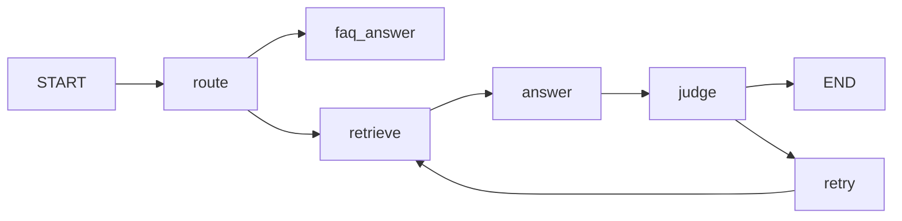

# LangGraph4j 到底解决什么问题

先说结论：

> LangChain4j 解决的是“怎么调用 LLM 和工具”，LangGraph4j 解决的是“这套流程怎么跑、怎么分支、怎么循环、怎么恢复”。

如果你只是做单轮问答、RAG、tool calling、简单 memory，很多时候只用 LangChain4j 就够了。

但一旦你的流程开始变成下面这样，LangGraph4j 就开始有价值了：

- 先判断要不要检索
- 检索后判断答案够不够
- 不够就追问或者重试
- 某一步需要人工确认
- 多个子任务并行跑
- 程序中断后还要接着跑

这时候你需要的不是“一个会调用模型的链”，而是“一个能编排流程的图”。

## 1. 只用 LangChain4j 时的典型写法

你通常会在一个 service 里写一长串逻辑：

```java
if (needSearch(question)) {
    var docs = search(question);
    if (docs.isEmpty()) {
        return askUserAgain();
    }
    var answer = llm.answer(question, docs);
    if (answerIsBad(answer)) {
        return retry();
    }
    return answer;
}

return llm.answer(question);
```

这种写法的问题不是“不能做”，而是：

- 逻辑越来越长
- 分支越来越多
- 重试和循环越来越难管
- 中断恢复很难做
- 后面加并行和 checkpoint 会更乱

## 2. 用 LangGraph4j 时的思路

你会把同样的流程拆成节点：

- `route`
- `retrieve`
- `answer`
- `judge`
- `retry`
- `end`

然后用边把它们连起来：

- 条件边决定走哪条路
- 循环边决定要不要重试
- checkpoint 决定能不能恢复

这样每一步都变得很清楚。

## 3. 一个更像真实项目的例子

比如“智能客服”：

### LangChain4j 直接写

你可能会在一个方法里做：

1. 判断是不是 FAQ
2. 不是 FAQ 就去检索知识库
3. 检索结果不够就追问用户
4. 答案生成后做一次自检
5. 自检不通过就重试

### LangGraph4j 写法

你会把它变成图：



这样以后你想加：

- 人工审批
- 并行检索
- 失败重试
- 断点恢复

都只是在图上加节点和边，而不是继续往一个 service 方法里堆代码。

## 4. 它和 LangChain4j 的关系

最合适的理解方式是：

- LangChain4j 是能力组件
- LangGraph4j 是流程编排

你完全可以把 LangChain4j 塞进 LangGraph4j 的节点里：

- 一个 node 调 LLM
- 一个 node 调 tool
- 一个 node 做判断
- 一个 node 做总结

也就是说，它们不是二选一，而是常常搭配用。

## 5. 什么时候没必要用 LangGraph4j

如果你的项目只是：

- 一个聊天接口
- 一次检索
- 一次函数调用
- 一个简单记忆

那 LangGraph4j 确实可能显得重了一点。

但如果你已经开始想这些问题：

- “下一步该去哪”
- “失败后要不要重试”
- “能不能暂停后恢复”
- “多个步骤能不能并行”

那就是 LangGraph4j 发挥作用的时候了。

## 6. 对你这个学习项目的意义

你现在学它，不是为了多一个库，而是为了把 agent 从“函数调用脚本”升级成“可编排的工作流”。

所以这个项目后面的路线才会是：

1. 最小图
2. 条件分支
3. 循环
4. checkpoint
5. 和 LangChain4j 结合
6. 完整案例

这条路走完，你就会很清楚它到底值不值。

