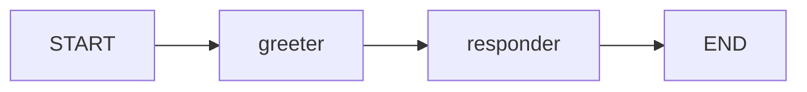

# 第一个可运行示例：最小图教程

这篇教程对应你当前项目里的最小可运行示例。

目标很简单：

1. 启动一个 Spring Boot 项目
2. 构建一个 LangGraph4j 的最小图
3. 让图按 `START -> greeter -> responder -> END` 跑完
4. 在控制台看到每一步状态变化

## 1. 这个示例要解决什么

它不是为了做“真正有业务价值”的 agent。

它是为了先把 LangGraph4j 的三个核心概念跑通：

- `State`
- `Node`
- `Edge`

只要这三件事理解了，后面的条件分支、循环、checkpoint、子图就都能顺着学下去。

## 2. 项目里有哪些文件

当前示例主要看这四个文件：

- [LangGraph4jDemoApplication.java](../../src/main/java/com/example/langgraph4jdemo/LangGraph4jDemoApplication.java)
- [SimpleGraphService.java](../../src/main/java/com/example/langgraph4jdemo/SimpleGraphService.java)
- [SimpleState.java](../../src/main/java/com/example/langgraph4jdemo/SimpleState.java)
- [GreeterNode.java](../../src/main/java/com/example/langgraph4jdemo/GreeterNode.java)
- [ResponderNode.java](../../src/main/java/com/example/langgraph4jdemo/ResponderNode.java)

## 3. 程序入口

`LangGraph4jDemoApplication` 是 Spring Boot 主类。

它除了启动 Spring 容器，还定义了一个 `ApplicationRunner`：

```java
@Bean
ApplicationRunner graphRunner(SimpleGraphService simpleGraphService) {
    return args -> simpleGraphService.runOnce();
}
```

### 这段代码的作用

Spring Boot 启动完成后，会自动执行 `runOnce()`。

所以你不需要手动点别的按钮，程序一起来，图就会跑。

## 4. State 是什么

`SimpleState` 是这个图共享的数据结构。

```java
public class SimpleState extends AgentState {
    public static final String MESSAGES_KEY = "messages";
    public static final Map<String, Channel<?>> SCHEMA = Map.of(
            MESSAGES_KEY, Channels.appender(ArrayList::new)
    );
}
```

### 你要记住两点

1. `state` 是所有节点共享的上下文
2. `messages` 用的是 `appender`，所以后续节点不是覆盖它，而是追加它

这就是为什么你最后能看到多条消息累积在一起。

## 5. 图是怎么建的

核心在 `SimpleGraphService`：

```java
var stateGraph = new StateGraph<>(SimpleState.SCHEMA, SimpleState::new)
        .addNode("greeter", node_async(greeterNode))
        .addNode("responder", node_async(responderNode))
        .addEdge(START, "greeter")
        .addEdge("greeter", "responder")
        .addEdge("responder", END);
```

### 这段代码在表达什么

- 先创建一个图
- 定义它的状态结构
- 加两个节点
- 定义节点之间的执行顺序

### 这里的 `var` 不是没有类型

你可能会注意到我写的是：

```java
var stateGraph = new StateGraph<>(SimpleState.SCHEMA, SimpleState::new)
```

这里的 `var` 只是让 Java 编译器自动推断类型，不是动态类型。

它等价于：

```java
StateGraph<SimpleState> stateGraph = new StateGraph<>(SimpleState.SCHEMA, SimpleState::new);
```

所以 `stateGraph` 的真实类型还是 `StateGraph<SimpleState>`，当然就能继续调用 `addNode()`、`addEdge()` 和 `compile()`。

### 为什么可以一直链式写下去

因为这些方法返回的都是同一个 `StateGraph` 对象，所以你可以连续调用：

- `addNode(...)`
- `addEdge(...)`
- `compile()`

这就是典型的 fluent API 写法，读起来会更像在“描述图”，而不是一行一行做命令式操作。

### 不是按 `addNode()` 的顺序执行

这一点很重要。

图真正的执行顺序，不是看你先 `addNode("greeter")` 还是先 `addNode("responder")`，而是看你怎么连边：

```java
.addEdge(START, "greeter")
.addEdge("greeter", "responder")
.addEdge("responder", END)
```

这组边才真正决定了运行路径：

`START -> greeter -> responder -> END`

也就是说，`addNode()` 只是把节点放进图里，`addEdge()` 才是规定谁先谁后。

如果以后加条件边、循环边、并行边，这种“边决定流程”的感觉会更明显。

图的逻辑可以画成这样：



## 6. 节点做了什么

### GreeterNode

它读取当前 state，然后追加一条问候消息。

```java
return Map.of(SimpleState.MESSAGES_KEY, "Hello from GreeterNode!");
```

### ResponderNode

它先检查前面有没有问候消息，再决定返回什么。

```java
if (currentMessages.contains("Hello from GreeterNode!")) {
    return Map.of(SimpleState.MESSAGES_KEY, "Acknowledged greeting!");
}
```

### 为什么这两个节点有意义

因为它们已经展示了 LangGraph4j 的最小闭环：

- 一个节点能读 state
- 一个节点能写 state
- 下一个节点能基于前一步结果继续执行

这就是图式工作流的核心味道。

## 7. 为什么要先 `compile()`

`StateGraph` 只是“图定义”。

真正能执行的是编译后的 `CompiledGraph`。

```java
this.compiledGraph = stateGraph.compile();
```

编译的意义是把“描述图”变成“可运行图”。

### 这里的 compile 不是 Java 编译

这个 `compile()` 不是你平时理解的 Java 编译，不是把源码变成 `.class`。

Java 编译是 Maven / `javac` 做的事。  
这里的 `compile()` 是 LangGraph4j 自己提供的方法，作用是：

- 检查图结构
- 固化节点和边
- 生成执行时要用的内部结构
- 把图从“配置阶段”切到“运行阶段”

你可以把它理解成：

- `StateGraph` = 图纸
- `CompiledGraph` = 可以直接施工的方案

## 8. 程序是怎么跑的

`runOnce()` 里传入初始 state：

```java
compiledGraph.stream(Map.of(SimpleState.MESSAGES_KEY, "Let's begin!"))
```

这表示图从这份初始数据开始执行。

运行时会看到：

1. `__START__` 进入
2. `greeter` 执行
3. `responder` 执行
4. `__END__` 结束

## 9. 为什么用 `stream()`

因为它会把执行过程一步一步打印出来。

这对学习非常好，原因有三个：

- 你能看到状态怎么变
- 你能确认节点有没有按顺序走
- 你能直接拿来调试

如果你只拿最终结果，反而不容易理解图怎么工作的。

## 10. 你在控制台应该看到什么

正确运行后，输出里应该有这些关键段落：

- `=== LangGraph4j minimal graph start ===`
- `NodeOutput{ node=__START__ ... }`
- `GreeterNode executing...`
- `NodeOutput{ node=greeter ... }`
- `ResponderNode executing...`
- `NodeOutput{ node=responder ... }`
- `NodeOutput{ node=__END__ ... }`
- `=== LangGraph4j minimal graph end ===`

最后退出码应该是 `0`。

## 11. 怎么验证功能真的正常

### 验证方式一：看控制台顺序

确认节点顺序是：

`START -> greeter -> responder -> END`

### 验证方式二：看 state 是否累积

你应该能看到 messages 最后变成三条：

- `Let's begin!`
- `Hello from GreeterNode!`
- `Acknowledged greeting!`

### 验证方式三：看程序是否正常结束

只要退出码是 `0`，就说明没有运行异常。

## 12. 这个示例学完以后你应该明白什么

你至少应该理解：

- state 是共享上下文
- node 是执行单元
- edge 是路由规则
- compile 后才能运行
- stream 能看到每一步执行

这五个点就是 LangGraph4j 的地基。

## 13. 这个示例还缺什么

它还没有展示：

- 条件分支
- 循环
- checkpoint
- 子图
- 并行分支

所以这个例子是“第一课”，不是“最终形态”。

## 14. 下一步怎么学

推荐顺序是：

1. 先彻底看懂这个最小图
2. 再做条件分支
3. 再做循环
4. 再做 checkpoint
5. 最后把 LangChain4j 接进来

这样最稳。
