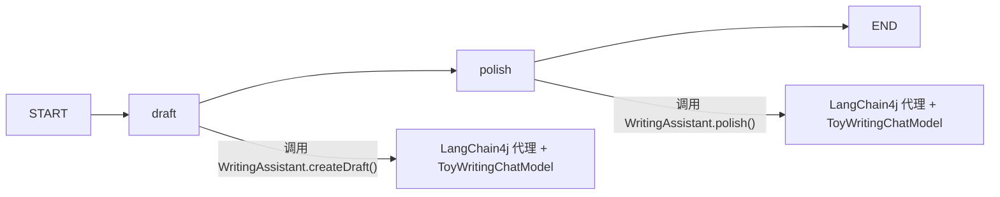

# 05 - 和 LangChain4j 结合

这一节要学的是：**LangGraph4j 负责流程编排，LangChain4j 负责单个模型能力**。

LangGraph4j 不替代 LangChain4j，而是把 LangChain4j 放进图里的某个节点，让整个流程变得可控、可拆、可测试。

## 1. 先看哪些文件

- `src/main/java/com/example/langgraph4jdemo/langchain/LangChainState.java`
- `src/main/java/com/example/langgraph4jdemo/langchain/WritingAssistant.java`
- `src/main/java/com/example/langgraph4jdemo/langchain/ToyWritingChatModel.java`
- `src/main/java/com/example/langgraph4jdemo/langchain/LangChainConfig.java`
- `src/main/java/com/example/langgraph4jdemo/langchain/DraftWithLangChainNode.java`
- `src/main/java/com/example/langgraph4jdemo/langchain/PolishWithLangChainNode.java`
- `src/main/java/com/example/langgraph4jdemo/langchain/LangChainBridgeService.java`

## 2. 这一节到底在干什么

这一节不是为了“再做一个能聊天的 AI”，而是为了看清楚：

1. LangGraph4j 负责把步骤排好
2. LangChain4j 负责把某一步里的 LLM 调用包起来
3. 节点之间只传 state，不互相硬耦合

这里我故意没有接真实模型，而是做了一个 `ToyWritingChatModel`。
这样你在本地就能稳定复现，不需要 API Key，也不会因为网络波动影响学习。

## 3. 运行流程



实际流程是：

1. `LangChainBridgeService` 启动时创建图
2. `StateGraph` 定义 `draft -> polish -> END`
3. `LangChainConfig` 把 `WritingAssistant` 注册成 Spring Bean
4. `DraftWithLangChainNode` 里调用 `writingAssistant.createDraft(...)`
5. `PolishWithLangChainNode` 里调用 `writingAssistant.polish(...)`
6. `ToyWritingChatModel` 根据提示词返回固定结果

## 4. 关键代码在做什么

### `WritingAssistant`

这是 LangChain4j 的“接口式提示词定义”。

- `@SystemMessage` 定义系统提示词
- `@UserMessage` 定义每个方法的用户提示词模板
- `AiServices.create(...)` 会根据这个接口生成代理对象

也就是说，你调用的不是普通实现类，而是一个由 LangChain4j 生成的代理。

### `LangChainConfig`

`LangChainConfig` 里把 `WritingAssistant` 做成了 Spring Bean。

这样节点就可以直接构造注入，不用自己手搓全局单例。

### `ToyWritingChatModel`

这是本节最重要的“演示模型”。

它实现了 LangChain4j 的 `ChatModel`，然后根据最后一句用户消息返回固定答案。

这么做的好处是：

- 可离线运行
- 可重复验证
- 能看清楚 LangChain4j 的接线过程

### `LangChainState`

这里保存了三个核心字段：

- `topic`：主题
- `draft`：草稿
- `finalAnswer`：最终结果

另外还有 `messages`，用来记录流程中发生了什么。

### `DraftWithLangChainNode` 和 `PolishWithLangChainNode`

这两个节点很像：

- 一个负责生成草稿
- 一个负责润色草稿

它们都只做一件事：

1. 从 state 里取值
2. 调 LangChain4j
3. 把新结果写回 state

### `LangChainBridgeService`

这里做的是图编排：

```java
var stateGraph = new StateGraph<>(LangChainState.SCHEMA, LangChainState::new)
        .addNode("draft", node_async(draftNode))
        .addNode("polish", node_async(polishNode))
        .addEdge(START, "draft")
        .addEdge("draft", "polish")
        .addEdge("polish", END);

this.compiledGraph = stateGraph.compile();
```

这表示：

- `StateGraph` 只是“图定义”
- `compile()` 之后才变成“可执行图”
- 最后通过 `compiledGraph.stream(...)` 跑起来

## 5. 为什么要这样设计

如果只用 LangChain4j，你当然也能直接调模型。
但一旦步骤变多，就会开始乱：

- 哪一步先执行
- 哪一步失败后重试
- 哪一步要暂停
- 哪一步要条件分支

LangGraph4j 的价值就在这里：

1. 把复杂流程拆成节点
2. 把执行顺序变成图
3. 把状态流转标准化
4. 把可暂停、可恢复、可分支这些能力放进一个统一框架里

而 LangChain4j 更像“单个节点里的工具箱”。

所以更准确的理解是：

- LangChain4j 解决“怎么调用模型”
- LangGraph4j 解决“怎么把多个调用组织起来”

## 6. 怎么验证

### 在 IDEA 里跑

直接运行 `LangGraph4jDemoApplication`。

启动后，控制台里应该能看到这一段：

- `=== LangChain4j bridge demo start ===`
- `DraftWithLangChainNode executing...`
- `LangChain4j draft: ...`
- `PolishWithLangChainNode executing...`
- `LangChain4j final answer: ...`
- `=== LangChain4j bridge demo end ===`

### 你应该关注什么

你不是只看“有没有输出”。
你要看的是：

1. 节点顺序对不对
2. state 有没有被写回去
3. `draft` 和 `finalAnswer` 有没有变
4. `messages` 有没有记录过程

### 一眼能看懂的结果

这次的输出说明：

- 图已经跑通
- 节点已经接上
- LangChain4j 代理已经生效
- 本地 toy model 已经替代真实模型完成演示

## 7. 这一节你该记住什么

1. LangGraph4j 是流程层，不是模型层
2. LangChain4j 是模型调用层，不是流程编排层
3. `AiServices.create(...)` 会把接口变成可调用代理
4. `StateGraph.compile()` 把“图定义”变成“可运行图”
5. 现在这套写法已经为后面的条件分支、循环、checkpoint、子图留好了位置

## 8. 下一步

下一节可以继续学：

- 条件分支的增强版
- 多节点循环里的状态传递
- checkpoint 和恢复执行
- 真正的 LangChain4j 生产接入

